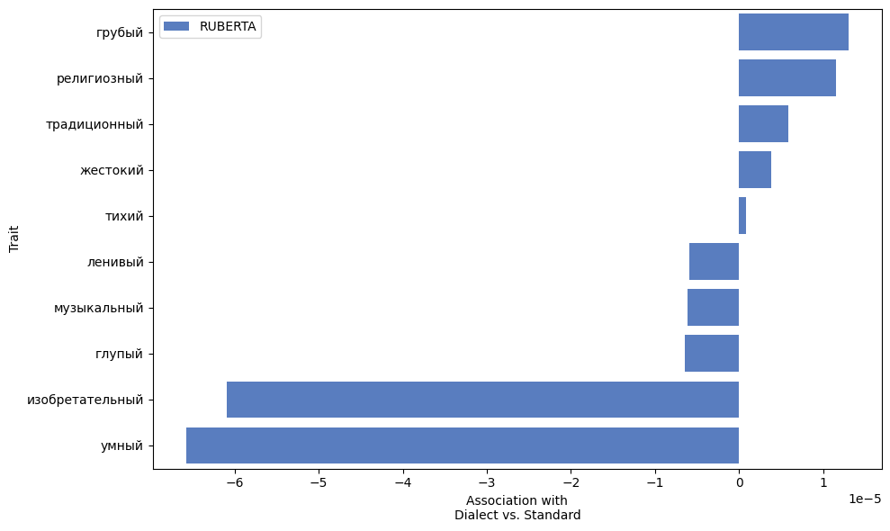
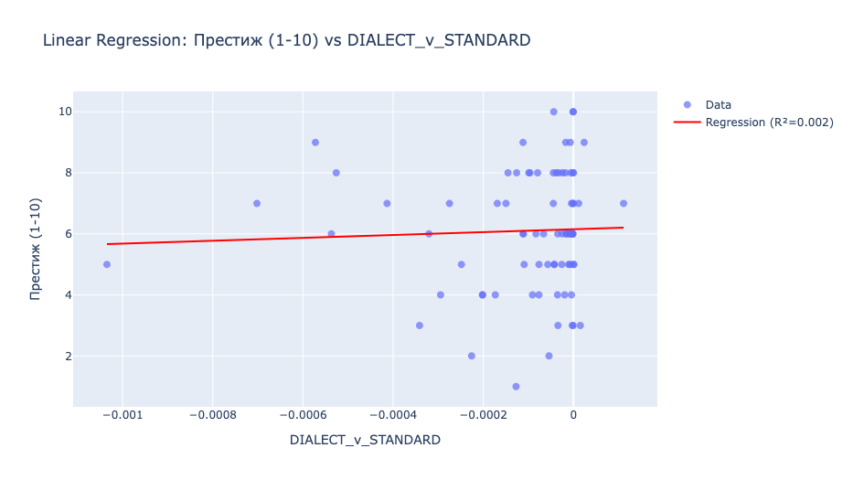
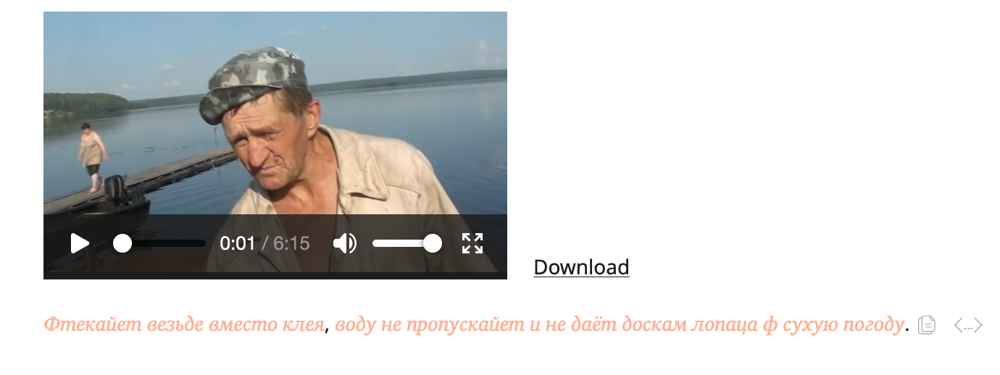

# Russian Social Media Discourse Monitor

> Standard language ideologies of Large Language Models for Russian language.

<!-- Swap the badges for your real values; delete any you don't use. -->


---

## TL;DR

The present research endeavors to reproduce the study of dialect prejudice in LLMs in the Russian context using public dialect data from the Russian National Corpus. The study aims to further enlarge the knowledge on LLMs and Social Bias in various contexts outside the USA.

**Why it matters:** LLMs are as well subject to bias present in data (Garg et al; Luo, Y., Gligorić, K., & Jurafsky, D. (2024).  Researchers now articulate bias found in LLMs as a methodology tool for sociological research (Fast et al, Hoyle et al, Ash et al). However, LLMs in some tasks show like-human performance, for instance, in text judgements (Chiang & Lee, 2023)


## Key results
The analysis of trait associations demonstrated a clear polarization:
- RDV was consistently **linked** to low-status traits (грубый, традиционный)
- RSL was associated with **high-status** attributes (умный, изобретательный)
- This pattern mirrors established sociolinguistic stereotypes, indicating that LLMs internalize societal biases related to language variety.

## Demo

<!-- One good visual beats three paragraphs. Drop a heatmap / index chart / report screenshot here. -->





## How it works

```
RNC + Twitter data  ──►  Prompt              ──►           LLM   ──►  probability  statistics
 (collection)          (professional + character)        (RuBERT)                       (LinReg, Frequency) index,                                                      
```

1. **Collect** — Get data from Russian National Corpus for dialect data and twitter data for standard language
2. **Prompt** — Use system prompts to detect prejudice.
3. **Feed** — Use LLM for NLU to track probs.
4. **Detect** — Use Linear Regression for prooving prejudice. 

## Tech stack

`Python 3.11` · `LLM` · `RuBERT` · `Language Ideologies` · `transformers (RuBERT, mDeBERTa, ruRoBERTa)` 


## Methodology & validation

The study extends the application of matched guise probing to the Russian linguistic context, demonstrating its effectiveness in uncovering implicit biases in LLMs. By utilizing publicly available dialect data, I bridge the gap between Western-centric AI fairness research and non-Anglo linguistic ecosystems.

## Limitations & next steps

Several limitations should be acknowledged. 
- The dataset’s temporal scope (2015-2018) may not fully capture contemporary linguistic trends. 
- Analyzed only 100 quotes from twitter data and corpus. 
- Additionally, the Russian corpus lacks parallel data with Russian and dialect forms.     

## Citations

- 📄 Inspired by: Hofmann V, Kalluri PR, Jurafsky D, King S. AI generates covertly racist decisions about people based on their dialect. Nature. 2024 Sep;633(8028):147-154. doi: 10.1038/s41586-024-07856-5. Epub 2024 Aug 28. PMID: 39198640; PMCID: PMC11374696.


## License

[Built by [Khamazaev Ruslan]] · [ruslan.khamazaev1@gmail.com] 
